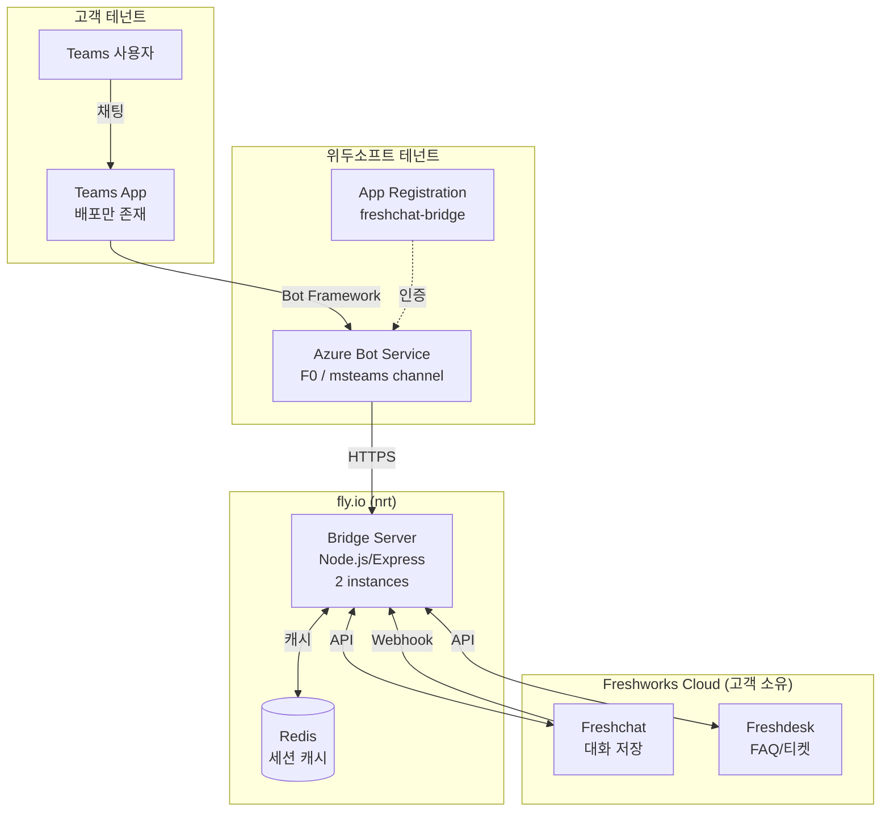
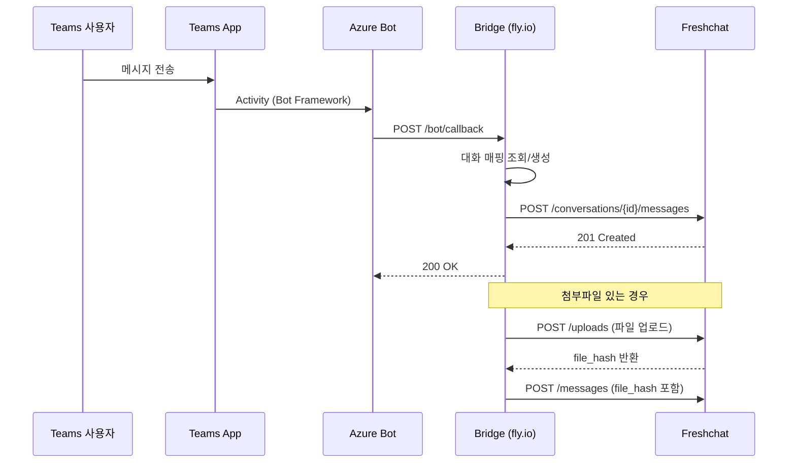
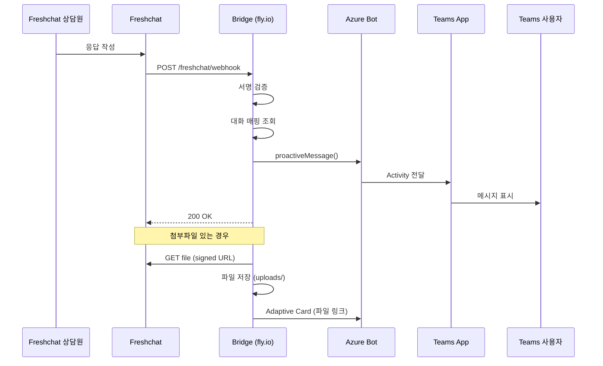

# As-Built 아키텍처 문서

**문서번호:** FCBRIDGE-2024-ARCH-001  
**작성일:** 2025-12-23  
**작성자:** 위두소프트

---

## 1. 시스템 구성요소

| 구성요소 | 소유 주체 | 위치/환경 | 역할 |
|----------|-----------|-----------|------|
| Teams 앱 | 고객 테넌트 배포 | Microsoft Teams | 사용자 인터페이스 |
| App Registration | 위두소프트 | Azure Entra ID | 인증/권한 관리 |
| Azure Bot Service | 위두소프트 | Azure (Global) | Bot Framework 연동 |
| Bridge 백엔드 | 위두소프트 | fly.io (nrt) | 메시지 변환/라우팅 |
| Freshchat | 고객 | Freshworks Cloud | 상담 플랫폼, 데이터 저장 |
| Redis | 위두소프트 | fly.io 연동 | 세션/매핑 캐시 |

### 주요 사항
- **고객 테넌트에는 Teams 앱 배포만 존재** (별도 App Registration/Bot 리소스 없음)
- **Bot 인프라 전체는 위두소프트 테넌트에 구축**
- **대화 원본 데이터는 Freshchat에 저장** (고객 소유/관리)

---

## 2. Azure 리소스 상세

### 2.1 App Registration (Production)

| 항목 | 값 |
|------|-----|
| Display Name | freshchat-bridge |
| App ID (Client ID) | `6a46afe9-3109-4af6-a0f9-275f6fddf929` |
| Tenant ID | `65e1f49c-c509-471a-9910-6ee6250fe2f6` |
| Sign-in Audience | AzureADMultipleOrgs (멀티테넌트) |
| Publisher Domain | wedosoft.net |
| Created | 2025-10-25 |

**Password Credentials:**
| 이름 | 만료일 | 비고 |
|------|--------|------|
| Bot Runtime - 20251026-1055 | 2026-04-24 | [REDACTED] |
| GitHub Action - 20251026-1046 | 2026-04-24 | [REDACTED] |

**API Permissions (Microsoft Graph):**
- `Directory.Read.All` (Role)
- `User.Read.All` (Role)
- `Team.ReadBasic.All` (Role)
- `Chat.Read.All` (Role)
- `ChannelMessage.Read.All` (Role)

### 2.2 Azure Bot Service (Production)

| 항목 | 값 |
|------|-----|
| Name | freshchat-bridge |
| Resource Group | my-vm-rg |
| SKU | F0 (Free) |
| Location | global |
| MSA App Type | SingleTenant |
| Messaging Endpoint | `https://freshchat-bridge.fly.dev/bot/callback` |
| Enabled Channels | webchat, directline, **msteams** |

### 2.3 Staging 환경 (참고)

| 항목 | 값 |
|------|-----|
| App Name | freshchat-bridge-staging |
| App ID | `ff8e490d-2cf9-424c-a431-84974a803474` |
| Messaging Endpoint | `https://freshchat-bridge-staging.fly.dev/bot/callback` |

---

## 3. Fly.io 인프라 상세

### 3.1 Production App

| 항목 | 값 |
|------|-----|
| App Name | freshchat-bridge |
| Hostname | freshchat-bridge.fly.dev |
| Organization | we-do-soft-inc |
| Primary Region | nrt (Tokyo) |
| Internal Port | 3978 |
| Min Machines | 2 |
| VM Size | shared-cpu-1x, 2GB RAM |

**현재 상태 (2025-12-23):**
| Machine ID | Version | State | Health Check |
|------------|---------|-------|--------------|
| 148e774b203328 | 227 | started | 1/1 passing |
| 5683772a562798 | 227 | started | 1/1 passing |

**설정 (fly.toml):**
```toml
[http_service]
  internal_port = 3978
  force_https = true
  auto_stop_machines = true
  auto_start_machines = true
  min_machines_running = 2

[http_service.concurrency]
  type = "connections"
  hard_limit = 50
  soft_limit = 25

[[http_service.checks]]
  interval = "15s"
  timeout = "10s"
  grace_period = "5s"
  method = "GET"
  path = "/"
```

### 3.2 Secrets (환경변수)

| 변수명 | 설명 | 민감도 |
|--------|------|--------|
| BOT_APP_ID | Azure App Client ID | Medium |
| BOT_APP_PASSWORD | Azure App Secret | **High** |
| BOT_TENANT_ID | Azure Tenant ID | Medium |
| FRESHCHAT_API_KEY | Freshchat API 인증키 | **High** |
| FRESHCHAT_API_URL | Freshchat API 엔드포인트 | Low |
| FRESHCHAT_INBOX_ID | 대상 Inbox ID | Low |
| FRESHCHAT_WEBHOOK_PUBLIC_KEY | 웹훅 서명 검증키 | **High** |
| REDIS_URL | Redis 연결 문자열 | **High** |
| PUBLIC_URL | Bridge 공개 URL | Low |
| SENTRY_DSN | 에러 모니터링 | Medium |
| FRESHDESK_API_KEY | Freshdesk API (FAQ 연동) | **High** |
| FRESHDESK_DOMAIN | Freshdesk 도메인 | Low |

---

## 4. 전체 아키텍처 다이어그램



---

## 5. 메시지 흐름 시퀀스

### 5.1 Teams → Freshchat (사용자 메시지)



### 5.2 Freshchat → Teams (상담원 응답)



---

## 6. 데이터 흐름 단계별 설명

| 단계 | 설명 | 처리 주체 |
|------|------|-----------|
| 1 | 사용자가 Teams에서 메시지 전송 | Teams Client |
| 2 | Bot Framework가 Activity 수신 | Azure Bot Service |
| 3 | Bridge가 Bot callback에서 메시지 처리 | fly.io Bridge |
| 4 | Freshchat API로 메시지 전송 | fly.io Bridge |
| 5 | Freshchat에 대화/메시지 저장 | Freshchat (고객 소유) |
| 6 | 상담원이 Freshchat에서 응답 | Freshchat Agent |
| 7 | Webhook으로 Bridge에 알림 | Freshchat |
| 8 | Bridge가 Bot Framework로 proactive 메시지 | fly.io Bridge |
| 9 | Teams 사용자에게 응답 전달 | Teams Client |

---

## 7. 주요 기술 스택

| 영역 | 기술 |
|------|------|
| Runtime | Node.js 18+ |
| Framework | Express.js |
| Bot SDK | botbuilder (Microsoft Bot Framework) |
| HTTP Client | axios |
| Cache | ioredis |
| File Handling | multer, form-data |
| Monitoring | Sentry |
| Deployment | fly.io (Docker) |

---

**문서 종료**
